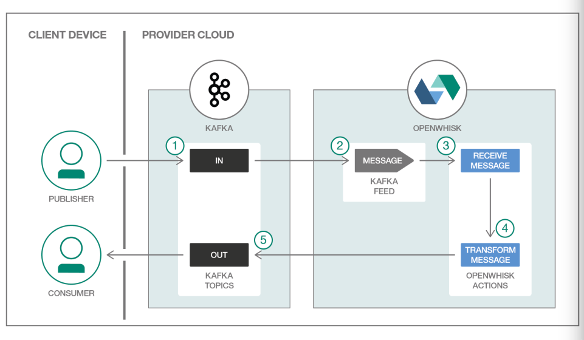

[](https://travis-ci.org/IBM/openwhisk-data-processing-message-hub)

# Message Hub data processing with OpenWhisk
This project shows the power of serverless, event-driven architectures to execute code in response to messages or to handle streams of data records.

It demonstrates two OpenWhisk actions (written in JavaScript) that read and write messages with Message Hub (based on Apache Kafka). The use case demonstrates how actions can work with data services and execute logic in response to message events.

One action receives message streams of one or more data records, and these are in turn piped to another action in an OpenWhisk sequence (a way to link actions declaratively in a chain). The second action aggregates the message and posts a transformed message to another topic.



## Included components

- OpenWhisk
- IBM Message Hub (Apache Kafka)

## Prerequisites

You should have a basic understanding of the OpenWhisk programming model. If not, [try the action, trigger, and rule demo first](https://github.com/IBM/openwhisk-action-trigger-rule).

Also, you'll need a Bluemix account and the latest [OpenWhisk command line tool (`wsk`) installed and on your PATH](https://github.com/IBM/openwhisk-action-trigger-rule/blob/master/docs/OPENWHISK.md).

As an alternative to this end-to-end example, you might also consider the more [basic "building block" version](https://github.com/IBM/openwhisk-message-hub-trigger) of this sample.

## Steps

1. [Configure IBM Message Hub](#1-configure-ibm-message-hub)
2. [Create OpenWhisk actions, triggers, and rules](#2-create-openwhisk-actions-triggers-and-rules)
3. [Test new message events](#3-test-new-message-events)
4. [Delete actions, triggers, and rules](#4-delete-actions-triggers-and-rules)
5. [Recreate deployment manually](#5-recreate-deployment-manually)


# 1. Configure IBM Message Hub
Log into Bluemix, provision a [Message Hub](https://console.ng.bluemix.net/catalog/services/message-hub) instance, and name it `kafka-broker`. On the "Manage" tab of your Message Hub console create two topics: _in-topic_ and _out-topic_.

Copy `template.local.env` to a new file named `local.env` and update the `KAFKA_INSTANCE`, `SRC_TOPIC`, and `DEST_TOPIC` values for your instance if they differ.

# 2. Create OpenWhisk actions, triggers, and rules
`deploy.sh` is a convenience script reads the environment variables from `local.env` and creates the OpenWhisk actions, triggers, and rules on your behalf. Later you will run the commands in the file directly.

```bash
./deploy.sh --install
```
> **Note**: If you see any error messages, refer to the [Troubleshooting](#troubleshooting) section below. You can also explore [Alternative deployment methods](#alternative-deployment-methods).

# 3. Test new message events
Open one terminal window to poll the logs:
```bash
wsk activation poll
```

Send a message with a set of events to process.
```bash
# Produce a message, will trigger the sequence of actions
DATA=$( base64 events.json | tr -d '\n' | tr -d '\r' )

wsk action invoke Bluemix_${KAFKA_INSTANCE}_Credentials-1/messageHubProduce \
  --param topic $SRC_TOPIC \
  --param value "$DATA" \
  --param base64DecodeValue true
```

# 4. Delete actions, triggers, and rules
Use `deploy.sh` again to tear down the OpenWhisk actions, triggers, and rules. You will recreate them step-by-step in the next section.

```bash
./deploy.sh --uninstall
```

# 5. Recreate deployment manually
This section provides a deeper look into what the `deploy.sh` script executes so that you understand how to work with OpenWhisk triggers, actions, rules, and packages in more detail.

## 5.1 Create Kafka message trigger
Create the `message-trigger` trigger using the Message Hub packaged feed that listens for new messages. The package refresh will make the Message Hub service credentials and connection information available to OpenWhisk.

```bash
wsk package refresh
wsk trigger create message-trigger \
  --feed Bluemix_${KAFKA_INSTANCE}_Credentials-1/messageHubFeed \
  --param isJSONData true \
  --param topic ${SRC_TOPIC}
```

## 5.2 Create action to consume message
Upload the `receive-consume` action as a single file Node.js action. This downloads messages when they arrive via the trigger.

```bash
wsk action create receive-consume actions/receive-consume.js
```

## 5.3 Create action to aggregate and send back message
Upload the `transform-produce` action as a zipped action, in order to include dependencies that are not in the default Node.js environment on OpenWhisk. This aggregates information from the action above, and sends a summary JSON string back to Kafka.

```bash
wsk action create transform-produce actions/transform-produce.js \
  --param topic ${DEST_TOPIC} \
  --param kafka ${KAFKA_INSTANCE}
```

## 5.4 Create sequence that links get and post actions
Declare a linkage between the `receive-consume` and `transform-produce` in a sequence named `message-processing-sequence`.

```bash
wsk action create message-processing-sequence --sequence receive-consume,transform-produce
```

## 5.5 Create rule that links trigger to sequence
Declare a rule named `message-rule` that links the trigger `message-trigger` to the sequence named `message-processing-sequence`.

```bash
wsk rule create message-rule message-trigger message-processing-sequence
```

## 5.6 Test new message events
```bash
# Produce a message, will trigger the sequence
DATA=$( base64 events.json | tr -d '\n' | tr -d '\r' )

wsk action invoke Bluemix_${KAFKA_INSTANCE}_Credentials-1/messageHubProduce \
  --param topic $SRC_TOPIC \
  --param value "$DATA" \
  --param base64DecodeValue true
```
# Troubleshooting
Check for errors first in the OpenWhisk activation log. Tail the log on the command line with `wsk activation poll` or drill into details visually with the [monitoring console on Bluemix](https://console.ng.bluemix.net/openwhisk/dashboard).

If the error is not immediately obvious, make sure you have the [latest version of the `wsk` CLI installed](https://console.ng.bluemix.net/openwhisk/learn/cli). If it's older than a few weeks, download an update.
```bash
wsk property get --cliversion
```

# Alternative deployment methods
`deploy.sh` will be replaced with [`wskdeploy`](https://github.com/openwhisk/openwhisk-wskdeploy) in the future. `wskdeploy` uses a manifest to deploy declared triggers, actions, and rules to OpenWhisk.

You can also use the following button to clone a copy of this repository and deploy to Bluemix as part of a DevOps toolchain. Supply your OpenWhisk and Message Hub credentials under the Delivery Pipeline icon, click Create, then run the Deploy stage for the Delivery Pipeline.

[](https://bluemix.net/deploy?repository=https://github.com/IBM/openwhisk-data-processing-message-hub.git)

# License
[Apache 2.0](LICENSE.txt)

# Credits
This project was inspired by and reuses significant amount of code from [this article](https://medium.com/openwhisk/transit-flexible-pipeline-for-iot-data-with-bluemix-and-openwhisk-4824cf20f1e0#.talwj9dno).
